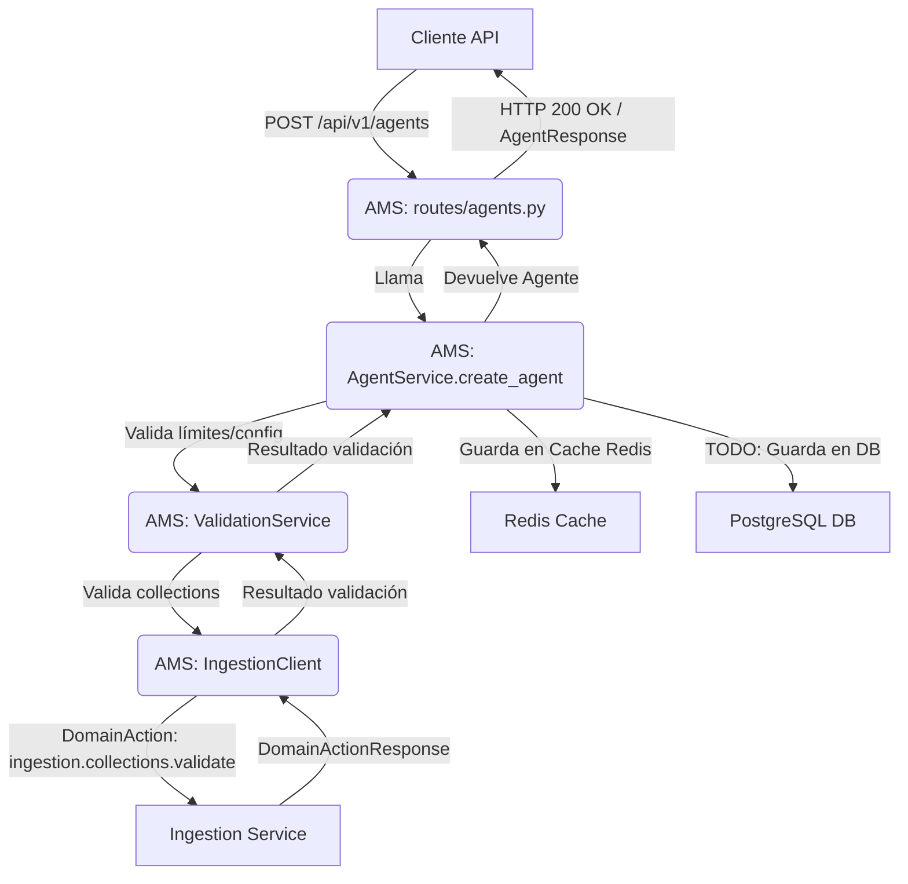
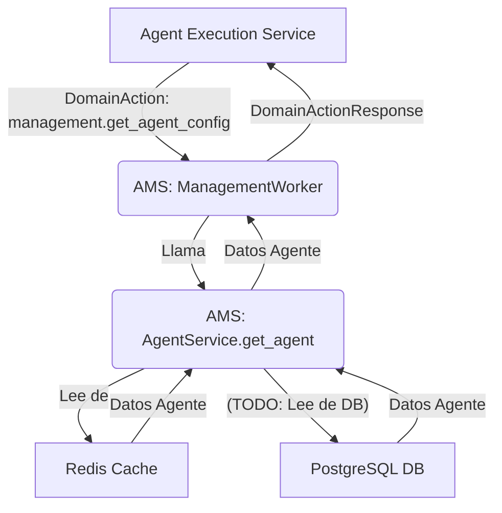

```markdown
# Documentación Detallada: Agent Management Service (AMS)

**Fecha de Documentación:** 2025-06-11

## 1. Objetivo del Servicio

El Agent Management Service (AMS) es un componente central de la plataforma Nooble4, responsable de la gestión integral de agentes conversacionales y sus plantillas. Sus objetivos principales son:

*   **Gestión de Agentes (CRUD):** Proveer funcionalidades para crear, leer, actualizar y eliminar (soft delete) agentes. Esto incluye la configuración de su comportamiento, tipo (conversacional, RAG, workflow), modelo LLM, herramientas, prompts de sistema, y asociaciones con colecciones de conocimiento.
*   **Gestión de Plantillas:** Administrar un catálogo de plantillas de agentes predefinidas (system templates) y permitir la creación y gestión de plantillas personalizadas por tenant (funcionalidad futura para persistencia de custom templates).
*   **Validación por Tier:** Aplicar reglas de negocio y límites basados en el tier de suscripción del tenant (e.g., número máximo de agentes, acceso a modelos LLM específicos, disponibilidad de herramientas y plantillas avanzadas).
*   **Configuración Centralizada:** Servir como la fuente de verdad para las configuraciones de los agentes, proveyéndolas a otros servicios como el Agent Execution Service (AES) cuando sea necesario.
*   **Integración con Otros Servicios:** Comunicarse con servicios como Ingestion Service (para validar colecciones) y Agent Execution Service (para invalidar cachés de configuración de agentes).
*   **Soporte para Agentes Públicos:** Facilitar la configuración de agentes para que sean accesibles públicamente a través de URLs (e.g., `usuario.nooble.ai/slug_del_agente`), aunque esta funcionalidad está marcada como parcialmente implementada.

## 2. Comunicación con Otros Servicios

AMS se comunica con otros servicios de la plataforma Nooble4 principalmente a través de Redis, utilizando colas para el intercambio de `DomainAction` y `DomainActionResponse`.

**Servicios con los que AMS se Comunica (Saliente):**

1.  **Agent Execution Service (AES):**
    *   **Acción:** `execution.cache.invalidate`
    *   **Propósito:** Notificar a AES que la configuración de un agente ha cambiado (actualización o eliminación) y que su caché local para dicho agente debe ser invalidada.
    *   **Mecanismo:** AMS (a través de `ExecutionClient`) envía un `DomainAction` a una cola de AES (e.g., `execution:{tenant_id}:actions`). Es una comunicación asíncrona (fire-and-forget).
    *   **Payload (`DomainAction.data`):** `{"agent_id": "<ID_DEL_AGENTE>"}`

2.  **Ingestion Service (IS):**
    *   **Acción 1:** `ingestion.collections.validate`
        *   **Propósito:** Validar que una lista de IDs de colecciones existen y son accesibles para un tenant específico. Esto se usa durante la creación o actualización de un agente que referencia colecciones.
        *   **Mecanismo:** AMS (a través de `IngestionClient`) envía un `DomainAction` a una cola de IS (e.g., `ingestion:{tenant_id}:actions`) y espera una `DomainActionResponse` en una cola de callback temporal (`agent_management_service:responses:{correlation_id}`). Es una comunicación pseudo-síncrona.
        *   **Payload (`DomainAction.data`):** `{"collection_ids": ["id1", "id2"]}`
        *   **Respuesta Esperada (`DomainActionResponse.data`):** `{"valid": True/False, "invalid_ids": [...]}`
    *   **Acción 2:** `ingestion.collections.list`
        *   **Propósito:** Obtener una lista de todas las colecciones disponibles para un tenant.
        *   **Mecanismo:** Pseudo-síncrono, similar a la validación.
        *   **Payload (`DomainAction.data`):** `{}`
        *   **Respuesta Esperada (`DomainActionResponse.data`):** `{"collections": [{"id": ..., "name": ...}, ...]}`

**Servicios que se Comunican con AMS (Entrante - Procesado por `ManagementWorker`):**

1.  **Cualquier Servicio (e.g., Agent Execution Service, UI Backend):**
    *   **Acción:** `management.validate_agent`
        *   **Propósito:** Solicitar a AMS la validación de una configuración de agente propuesta contra los límites del tier y la validez de las colecciones.
        *   **Mecanismo:** Un servicio envía un `DomainAction` a la cola principal de AMS (`agent_management_service:actions`). Puede ser pseudo-síncrono si se especifica `callback_queue_name`.
        *   **Payload (`DomainAction.data`):** `AgentValidationAction` (contiene `agent_config` y `collections`).
    *   **Acción:** `management.get_agent_config`
        *   **Propósito:** Solicitar la configuración completa y actual de un agente específico.
        *   **Mecanismo:** Pseudo-síncrono. El solicitante espera una `DomainActionResponse` con los datos del agente.
        *   **Payload (`DomainAction.data`):** `GetAgentConfigData` (contiene `agent_id`, `tenant_id`).
        *   **Respuesta (`DomainActionResponse.data`):** Modelo `Agent` serializado.
    *   **Acción:** `management.update_agent_config`
        *   **Propósito:** Solicitar la actualización de la configuración de un agente.
        *   **Mecanismo:** Pseudo-síncrono o asíncrono.
        *   **Payload (`DomainAction.data`):** `UpdateAgentConfigData` (contiene `agent_id`, `tenant_id`, `update_data`).
    *   **Acción:** `management.delete_agent_config`
        *   **Propósito:** Solicitar la eliminación (soft delete) de un agente.
        *   **Mecanismo:** Pseudo-síncrono o asíncrono.
        *   **Payload (`DomainAction.data`):** `DeleteAgentConfigData` (contiene `agent_id`, `tenant_id`).

2.  **Ingestion Service (IS):**
    *   **Acción:** `management.collection_ingestion_status`
        *   **Propósito:** Notificar a AMS sobre el estado final de un proceso de ingestión de una colección (e.g., 'COMPLETED', 'FAILED').
        *   **Mecanismo:** IS envía un `DomainAction` a la cola de AMS. Es una comunicación asíncrona (fire-and-forget).
        *   **Payload (`DomainAction.data`):** `CollectionIngestionStatusData` (contiene `collection_id`, `tenant_id`, `status`, `message`). AMS usa esto para actualizar el estado de las colecciones asociadas a los agentes (actualmente en Redis).

## 3. Responsabilidades de Archivos y Directorios Internos

*   **`main.py`**: Punto de entrada de la aplicación FastAPI. Configura la aplicación, inicializa recursos (Redis, `DomainQueueManager`), registra routers y el `ManagementWorker` como tarea de fondo (`lifespan` context manager).
*   **`config/`**: Contiene la configuración del servicio.
    *   `settings.py`: Define `AgentManagementSettings` (Pydantic model) para cargar configuraciones desde variables de entorno (prefijo `AGENT_MANAGEMENT_`). Incluye `service_name`, `templates_path`, `tier_limits` (fundamental para la validación), `enable_collection_validation`, etc.
    *   `__init__.py`: Expone `get_settings`.
*   **`workers/`**: Implementa el procesamiento de acciones de dominio en segundo plano.
    *   `management_worker.py`: Define `ManagementWorker` (hereda de `BaseWorker 4.0`). Escucha en la cola principal de AMS (`agent_management_service:actions`). Implementa `_handle_action` para enrutar `DomainAction`s a métodos específicos de `AgentService` (e.g., `_handle_get_agent_config`, `_handle_validate_agent`). Soporta respuestas pseudo-síncronas enviando `DomainActionResponse` a colas de callback.
    *   `__init__.py`: Expone `ManagementWorker`.
*   **`services/`**: Contiene la lógica de negocio principal.
    *   `agent_service.py`: (`AgentService`) Lógica CRUD para agentes, validación de tiers (delegando a `ValidationService`), gestión de caché de agentes en Redis, comunicación con `ExecutionClient` para invalidación de caché, y con `IngestionClient` (indirectamente vía `ValidationService`). Marcado con TODOs para persistencia en base de datos (actualmente usa Redis como sustituto temporal).
    *   `template_service.py`: (`TemplateService`) Lógica para cargar y listar plantillas de agentes (actualmente carga plantillas del sistema hardcodeadas, con TODOs para plantillas custom de tenant desde BD). Provee funcionalidad para crear una configuración de agente base a partir de una plantilla.
    *   `validation_service.py`: (`ValidationService`) Valida configuraciones de agentes y límites de tenant/tier (e.g., `max_agents`, herramientas/modelos disponibles, `max_collections_per_agent`). Valida la existencia de colecciones a través de `IngestionClient`. Marcado con TODO para contar agentes actuales desde BD.
    *   `__init__.py`: Expone las clases de servicio.
*   **`models/`**: Define los modelos de datos Pydantic.
    *   `agent_model.py`: Define `Agent` (modelo principal), `AgentType`, `CreateAgentRequest`, `UpdateAgentRequest`, `AgentResponse`, `AgentListResponse`. El modelo `Agent` incluye el método `to_execution_context()`.
    *   `template_model.py`: Define `AgentTemplate`, `TemplateCategory`, `CreateTemplateRequest`, `TemplateResponse`, `TemplateListResponse`.
    *   `actions_model.py`: Define los modelos Pydantic para los payloads de `DomainAction`s específicos de AMS (e.g., `AgentValidationAction`, `GetAgentConfigData`, `CollectionIngestionStatusData`).
    *   `__init__.py`: Expone los modelos principales.
*   **`clients/`**: Implementa la comunicación con otros servicios.
    *   `execution_client.py`: (`ExecutionClient`) Envía acciones `execution.cache.invalidate` a AES vía Redis.
    *   `ingestion_client.py`: (`IngestionClient`) Envía acciones `ingestion.collections.validate` e `ingestion.collections.list` a Ingestion Service y maneja respuestas pseudo-síncronas.
    *   `__init__.py`: Expone las clases de cliente.
*   **`routes/`**: Define los endpoints de la API HTTP (FastAPI).
    *   `agents.py`: Endpoints CRUD para `/api/v1/agents` (crear, obtener, actualizar, eliminar, listar agentes). Requieren headers `X-Tenant-ID` y `X-Tenant-Tier`.
    *   `templates.py`: Endpoints para `/api/v1/templates` (listar, obtener template, crear agente desde template). También usan headers de tenant.
    *   `health.py`: Endpoint `/internal/metrics` (actualmente con métricas placeholder).
    *   `__init__.py`: Expone los routers.
*   **`templates/` (Directorio Raíz)**: Contiene archivos JSON de ejemplo para plantillas de sistema (e.g., `customer_service.json`). Aunque `TemplateService` actualmente las hardcodea, este directorio sugiere la intención original o futura de cargarlas desde archivos.
*   **`README.md`**: Documentación de alto nivel del servicio, objetivos, arquitectura, acciones de dominio, endpoints HTTP, variables de entorno, y próximos pasos.
*   **`requirements.txt`**: Lista las dependencias Python del servicio.
*   **`__init__.py` (Directorio Raíz)**: Archivo vacío o con metadatos del paquete principal.

## 4. Mecanismos de Comunicación y Patrones Arquitectónicos

*   **API HTTP (FastAPI):** Expone funcionalidades CRUD para agentes y plantillas, principalmente para ser consumidas por UIs de administración o backends de Nobile (CRM).
*   **Comunicación Inter-Servicios vía Redis (Domain Actions):**
    *   **Colas de Acciones:** AMS tiene una cola principal (e.g., `agent_management_service:actions`) donde `ManagementWorker` escucha por `DomainAction`s entrantes.
    *   **Colas de Respuesta (Pseudo-Síncrono):** Para solicitudes donde AMS necesita una respuesta de otro servicio (e.g., `IngestionClient.validate_collections`), crea una cola de respuesta temporal (e.g., `agent_management_service:responses:{correlation_id}`), envía la `DomainAction` con `callback_queue_name` y `correlation_id`, y realiza un `BRPOP` en su cola de respuesta. El servicio destino envía una `DomainActionResponse` a esta cola.
    *   **Fire-and-Forget:** Para notificaciones como la invalidación de caché (`ExecutionClient.invalidate_agent_cache`), AMS simplemente encola la `DomainAction` y no espera respuesta.
*   **BaseWorker 4.0:** El `ManagementWorker` sigue el patrón `BaseWorker 4.0`, que estandariza el procesamiento de `DomainAction`s mediante un método `_handle_action` centralizado, mejorando la coherencia con otros workers del sistema Nooble4.
*   **Pydantic Models:** Usados extensivamente para la validación de datos en API requests/responses, configuraciones de agentes/plantillas, y payloads de `DomainAction`s.
*   **Dependency Injection (FastAPI):** Utilizado para gestionar dependencias como instancias de servicio y clientes Redis en los endpoints HTTP.
*   **Caché en Redis:** `AgentService` utiliza Redis para cachear configuraciones de agentes (`agent:{tenant_id}:{agent_id}`) con un TTL definido. Esto es para acelerar la recuperación de configuraciones, especialmente para `ManagementWorker` al responder a `management.get_agent_config`.
*   **Configuración Centralizada (Settings):** Las configuraciones del servicio, incluyendo los importantes `tier_limits`, se gestionan centralizadamente a través de `config/settings.py` y variables de entorno.

## 5. Identificación de Inconsistencias y Código Muerto/Duplicado

*   **Persistencia Primaria en Redis (Inconsistencia Mayor):**
    *   La inconsistencia más significativa es el uso de Redis no solo como caché sino como el **almacenamiento primario temporal** para los datos de agentes y el estado de las colecciones. Múltiples TODOs en `AgentService`, `ValidationService` y `TemplateService` indican la necesidad de migrar a una base de datos persistente (PostgreSQL según el README y otras documentaciones de Nooble4).
    *   Esto presenta riesgos de pérdida de datos si Redis falla y no está configurado para persistencia robusta, y limita la capacidad de realizar consultas complejas o análisis sobre los datos de los agentes.
*   **Métricas Parcialmente Implementadas:**
    *   El endpoint `/internal/metrics` en `routes/health.py` devuelve principalmente placeholders. Las métricas reales sobre el uso de agentes, caché, etc., no están implementadas.
*   **Funcionalidad de Agentes Públicos Parcial:**
    *   El modelo `Agent` tiene campos `slug` y `is_public`, y el README menciona URLs públicas (e.g., `usuario.nooble.ai/slug_del_agente`), pero la infraestructura completa para servir estos agentes públicamente (e.g., un gateway o servicio frontend que los consuma) no forma parte de AMS y su estado de implementación global no está claro solo desde AMS.
*   **Carga de Plantillas del Sistema:**
    *   `TemplateService._load_system_templates()` hardcodea las plantillas del sistema, a pesar de la existencia de un directorio `templates/` con archivos JSON que parecen ser las definiciones de estas plantillas. Esto podría ser una inconsistencia o una simplificación temporal.
*   **Conteo de Agentes para Límites de Tenant:**
    *   `ValidationService.validate_tenant_limits()` tiene un TODO para contar los agentes actuales del tenant desde la base de datos. Actualmente, esta validación crucial está incompleta (`current_count = 0`).
*   **Listado de Agentes con Paginación Incompleta:**
    *   En `routes/agents.py`, la ruta `list_agents` devuelve `total=len(agents)` que solo representa el total de la página actual, no el total real de agentes del tenant. Esto también depende de la implementación de la base de datos.
*   **Uso de `redis.keys()` en `AgentService._get_agent_from_cache`:**
    *   El método `_get_agent_from_cache` usa `redis.keys(f"agent:*:{agent_id}")` para encontrar un agente cuando el `tenant_id` no está disponible directamente. Aunque funcional para un número bajo de tenants, `KEYS` es una operación que puede ser lenta y bloquear Redis en entornos con muchas claves, y generalmente se desaconseja en producción. Una estructura de datos alternativa o un índice secundario en Redis podría ser más eficiente si el `tenant_id` no puede pasarse siempre.
*   **Colas de Acciones por Tenant para Servicios Downstream:**
    *   Tanto `ExecutionClient` como `IngestionClient` envían acciones a colas específicas del tenant (e.g., `execution:{tenant_id}:actions`, `ingestion:{tenant_id}:actions`). Si bien esto puede ser una estrategia de diseño deliberada para el particionamiento de trabajo en AES e IS, debe estar bien documentado y alineado con la forma en que esos servicios realmente consumen sus acciones. Si AES o IS esperan una única cola de acciones global o por tier, esto sería una inconsistencia. (Referencia: MEMORY [9395f05a-ecfb-4003-ad50-a3deff0156af] sobre nomenclatura de colas).

**Código Muerto/Duplicado:**

*   No se identificó código evidentemente muerto o duplicado de forma significativa dentro de AMS durante esta revisión. La estructura parece razonablemente limpia, con los TODOs marcando áreas incompletas en lugar de obsoletas.

## 6. Integración con Otros Servicios y Flujo de Datos

**Flujo Principal: Creación de un Agente (vía API)**

1.  **Request API:** Un cliente (e.g., UI de Nooble) envía un `POST /api/v1/agents` a AMS con `CreateAgentRequest` en el body y `X-Tenant-ID`, `X-Tenant-Tier` en headers.
2.  **AMS (`routes/agents.py`):** Recibe la solicitud.
3.  **AMS (`AgentService.create_agent`):**
    *   Llama a `ValidationService.validate_tenant_limits()` (actualmente incompleto para conteo de agentes).
    *   Llama a `ValidationService.validate_agent_config()` para validar la configuración del agente contra los límites del tier (modelos, herramientas, etc.).
    *   Si se especifican `collections`, llama a `ValidationService.validate_collections()`:
        *   `ValidationService` llama a `IngestionClient.validate_collections()`.
        *   `IngestionClient` envía `ingestion.collections.validate` (DomainAction) a Ingestion Service (pseudo-síncrono) y espera respuesta.
        *   Ingestion Service responde si las colecciones son válidas.
    *   Si todas las validaciones pasan, se crea una instancia del modelo `Agent`.
    *   **TODO:** El agente se guarda en la base de datos.
    *   El agente se guarda en la caché de Redis (`_save_agent_to_cache`).
4.  **AMS (`routes/agents.py`):** Devuelve `AgentResponse` con el agente creado.

**Flujo Principal: Actualización de un Agente (vía API)**

1.  **Request API:** `PUT /api/v1/agents/{agent_id}` con `UpdateAgentRequest`.
2.  **AMS (`routes/agents.py`):** Recibe la solicitud.
3.  **AMS (`AgentService.update_agent`):**
    *   Obtiene el agente existente (de caché o BD - TODO).
    *   Realiza validaciones similares a la creación si la configuración cambia.
    *   Actualiza el modelo `Agent`.
    *   **TODO:** Guarda el agente actualizado en la base de datos.
    *   Guarda el agente actualizado en la caché de Redis.
    *   Llama a `ExecutionClient.invalidate_agent_cache(agent_id, tenant_id)`.
        *   `ExecutionClient` envía `execution.cache.invalidate` (DomainAction) a Agent Execution Service (asíncrono).
4.  **AMS (`routes/agents.py`):** Devuelve `AgentResponse` con el agente actualizado.

**Flujo Principal: Solicitud de Configuración de Agente (por otro servicio, e.g., AES)**

1.  **AES (u otro servicio):** Necesita la configuración del agente `agent-123`.
2.  **AES (`AgentManagementClient` dentro de AES):** Envía un `DomainAction` `management.get_agent_config` a la cola de AMS (`agent_management_service:actions`). Especifica `callback_queue_name` y `correlation_id`.
3.  **AMS (`ManagementWorker`):** Recibe la acción.
    *   Llama a `AgentService.get_agent(agent_id, tenant_id)`.
    *   `AgentService` intenta obtener el agente de su caché Redis. Si no, **TODO: lo obtendría de BD**.
    *   Si se encuentra, `ManagementWorker` envía una `DomainActionResponse` con los datos del agente a la `callback_queue_name` especificada por AES.
4.  **AES (`AgentManagementClient`):** Recibe la `DomainActionResponse` y obtiene la configuración del agente.

**Diagrama de Flujo Simplificado (Creación de Agente):**



**Diagrama de Flujo Simplificado (AES obtiene Config Agente):**



```

**Resumen General:**

El Agent Management Service está bien estructurado y sigue los patrones arquitectónicos de Nooble4 (FastAPI, Domain Actions, BaseWorker 4.0, Pydantic). Su rol es crucial para la gestión de la inteligencia de la plataforma. Las principales áreas de mejora giran en torno a la implementación de la persistencia en base de datos (actualmente una dependencia crítica faltante que afecta múltiples funcionalidades como límites de tenant, listado completo, y la propia supervivencia de los datos de agentes) y la compleción de funcionalidades marcadas como TODO (métricas, conteo de agentes para validación). La comunicación inter-servicios está claramente definida, aunque la estrategia de colas por tenant para servicios downstream merece confirmación de alineamiento con dichos servicios.
