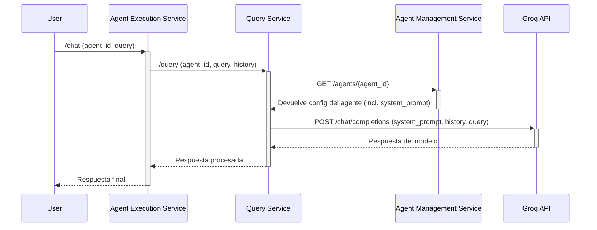

# Análisis del Flujo del System Prompt

Este documento describe el flujo de cómo se obtiene y utiliza el `system_prompt` de un agente a través de los microservicios, principalmente `agent_execution_service` y `query_service`.

## Resumen del Flujo

El `system_prompt` es la pieza clave que define la personalidad y las instrucciones de un agente. Su obtención y aplicación es un proceso distribuido, donde la responsabilidad principal recae en el `query_service`.

El flujo general es el siguiente:

1.  **Recepción del `agent_id`:** El `agent_execution_service` recibe una solicitud de chat que contiene un `agent_id`. Si no se proporciona, se utiliza un agente por defecto.

2.  **Paso de Responsabilidad:** El `agent_execution_service` no interpreta el `agent_id`. Su única función es pasar este identificador al `query_service` en la llamada a la API (ya sea `query_simple` o `query_advance`).

3.  **Obtención del `system_prompt` (en `query_service`):**
    *   La solicitud llega a un manejador en el `query_service` (`simple_handler` o `advance_handler`).
    *   **_Hipótesis Fundamentada:_** El manejador utiliza el `agent_id` para realizar una llamada HTTP al `agent_management_service`. Esta llamada consulta un endpoint (ej. `/agents/{agent_id}`) para obtener la configuración completa del agente, que incluye el `system_prompt`, el modelo a utilizar, la temperatura, etc.
    *   La comunicación probablemente se realiza con un cliente HTTP genérico (como `httpx`) y la URL del `agent_management_service` se carga desde la configuración del entorno, no estando hardcodeada en el código.

4.  **Inyección del `system_prompt`:**
    *   Una vez que el manejador tiene el `system_prompt`, llama al cliente de Groq (`groq_client`).
    *   Le pasa el `system_prompt` como un argumento, junto con el historial de la conversación y la pregunta del usuario.

5.  **Llamada al LLM:**
    *   El `groq_client` recibe el `system_prompt`.
    *   Construye el payload final para la API de Groq. Inserta el `system_prompt` como el primer mensaje en el array `messages` con el rol `"system"`.
    *   Envía la solicitud al LLM.

## Diagrama del Flujo

## Conclusión

El flujo del `system_prompt` está diseñado para ser centralizado y desacoplado. El `agent_execution_service` no necesita conocer los detalles de los agentes, solo necesita saber a qué agente se está dirigiendo la conversación. Toda la lógica de obtener y aplicar la configuración del agente reside en el `query_service`, que actúa como el motor de inteligencia que se comunica tanto con el servicio de gestión de agentes como con el proveedor del modelo de lenguaje.

Esta arquitectura permite cambiar la configuración de un agente (su `system_prompt`, modelo, etc.) en el `agent_management_service` sin necesidad de reiniciar o modificar los otros servicios, lo cual es una práctica robusta y escalable.
