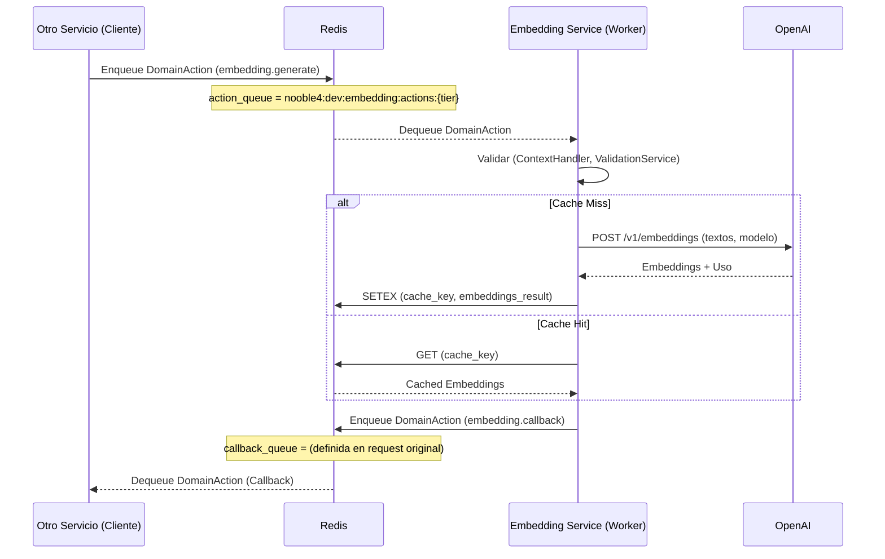
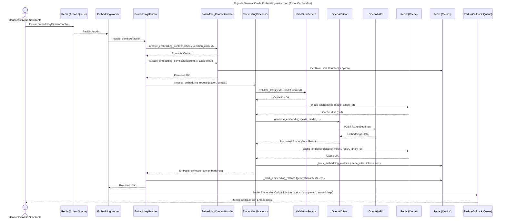
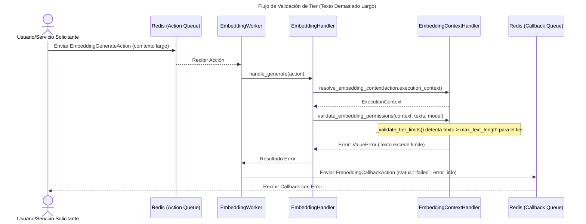

# Documentación Detallada: Embedding Service

## 1. Objetivo del Servicio

El **Embedding Service** es un componente crucial de la plataforma Nooble4, responsable de generar representaciones vectoriales (embeddings) de texto utilizando modelos avanzados de Machine Learning, principalmente de OpenAI. Su propósito fundamental es convertir texto en un formato numérico que pueda ser utilizado por otros servicios para tareas como búsqueda semántica, clustering, clasificación, y como base para sistemas de Retrieval Augmented Generation (RAG).

Características principales:

- **Generación de Embeddings**: Utiliza modelos de OpenAI (ej. `text-embedding-3-small`, `text-embedding-3-large`) para convertir lotes de texto en vectores de alta dimensionalidad.
- **Procesamiento Asíncrono y Sincrónico**: Aunque su diseño principal se orienta al procesamiento asíncrono mediante Domain Actions y colas Redis, también contempla la posibilidad de interacciones pseudo-sincrónicas.
- **Gestión por Tiers**: Aplica límites y validaciones diferenciadas según el tier del tenant (ej. free, basic, professional, enterprise), controlando el tamaño de los batches, la longitud del texto, los modelos permitidos y los rate limits.
- **Caching**: Implementa un sistema de caché en Redis para los embeddings generados, reduciendo la latencia y el costo de llamadas repetidas a la API de OpenAI. El caché es sensible al tenant y al modelo.
- **Manejo de Colas por Tier**: Utiliza `DomainQueueManager` para procesar solicitudes de embeddings desde colas Redis segregadas por tier, permitiendo priorización y gestión de carga diferenciada.
- **Métricas Detalladas**: Registra métricas operativas en Redis, incluyendo el número de generaciones, textos procesados, tokens consumidos, tiempos de procesamiento, y estadísticas de caché (hits/misses).
- **Validación Robusta**: Realiza validaciones exhaustivas de las solicitudes, incluyendo permisos, límites de tier, y compatibilidad de modelos antes de procesar.

## 2. Comunicación con Otros Servicios (Domain Actions)

El Embedding Service se comunica con otros servicios principalmente a través de **Domain Actions** y colas Redis, siguiendo el patrón estándar de la plataforma Nooble4.

### Actions Escuchadas:

El servicio (específicamente el `EmbeddingWorker`) escucha y procesa las siguientes `DomainAction`s en sus colas de entrada (ej. `nooble4:{env}:embedding:actions:{tier}`):

1.  **`embedding.generate`** (`EmbeddingGenerateAction`):
    *   **Propósito**: Solicita la generación asíncrona de embeddings para una lista de textos.
    *   **Payload Esperado** (`EmbeddingGenerateAction`):
        *   `texts: List[str]` (Textos a embeber)
        *   `model: Optional[str]` (Modelo de OpenAI a utilizar)
        *   `collection_id: Optional[UUID]` (ID de colección opcional)
        *   `chunk_ids: Optional[List[str]]` (IDs de chunks opcionales)
    *   **Campos de `DomainAction` Base Utilizados**:
        *   `execution_context` (Contiene `tenant_id`, `tenant_tier`, `session_id`)
        *   `callback_queue_name` (Cola donde se enviará el resultado/callback)
        *   `task_id` (ID único de la tarea)

2.  **`embedding.generate.sync`** (`EmbeddingGenerateAction`):
    *   **Propósito**: Solicita la generación de embeddings con un patrón pseudo-sincrónico. El worker procesa la acción y envía una `DomainActionResponse` a una cola de respuesta específica (generalmente derivada del `correlation_id`).
    *   **Payload Esperado**: Similar a `embedding.generate`, pero el `correlation_id` es crucial para la respuesta.

3.  **`embedding.validate`** (`EmbeddingValidateAction`):
    *   **Propósito**: Solicita la validación de una lista de textos contra un modelo y los límites del tier, sin generar embeddings.
    *   **Payload Esperado** (`EmbeddingValidateAction`):
        *   `texts: List[str]` (Textos a validar)
        *   `model: Optional[str]` (Modelo contra el cual validar)
    *   **Respuesta**: Generalmente se maneja de forma pseudo-sincrónica o con un callback específico.

4.  **`embedding.callback`** (`EmbeddingCallbackAction`):
    *   **Propósito**: Aunque el servicio *envía* principalmente callbacks, podría estar configurado para procesar ciertos tipos de callbacks entrantes si fuera necesario para flujos más complejos (no es el caso primario observado).

### Actions Emitidas (Callbacks):

Tras procesar una solicitud de `embedding.generate` (o `embedding.validate` si se configura con callback), el `EmbeddingCallbackHandler` emite una `DomainAction` de tipo `embedding.callback` a la `callback_queue_name` especificada en la solicitud original.

1.  **`embedding.callback`** (`EmbeddingCallbackAction`):
    *   **Propósito**: Informar el resultado (éxito o fallo) de la operación de embedding.
    *   **Payload Enviado** (`EmbeddingCallbackAction`):
        *   `status: str` ("completed" o "failed")
        *   `embeddings: List[List[float]]` (Vectores generados, vacío si falló)
        *   `model: str` (Modelo utilizado)
        *   `dimensions: int` (Dimensiones de los vectores)
        *   `total_tokens: int` (Tokens consumidos)
        *   `processing_time: float` (Tiempo de procesamiento)
        *   `error: Optional[Dict[str, Any]]` (Detalles del error si `status` es "failed")
    *   **Campos de `DomainAction` Base Utilizados**:
        *   `correlation_id` (Generalmente el `task_id` de la acción original)
        *   `trace_id` (Propagado desde la acción original)
        *   `tenant_id`, `session_id` (Propagados)

### Diagrama de Flujo de Comunicación (Asíncrono con Callback):

## 3. Responsabilidades de Archivos y Directorios Internos

El Embedding Service sigue una estructura modular estándar:

-   **`main.py`**: Punto de entrada del servicio FastAPI. Configura la aplicación, el logging, CORS, manejo de errores, y gestiona el ciclo de vida del `EmbeddingWorker`. Inicializa el `DomainQueueManager` para colas por tier y expone endpoints de health y métricas (`/metrics/overview`, `/metrics/queues`).
-   **`config/`**: Contiene la configuración del servicio.
    -   **`settings.py`**: Define `EmbeddingServiceSettings` (hereda de `common.config.Settings`) con todos los parámetros configurables: API keys, modelos OpenAI soportados (`OPENAI_MODELS` con dimensiones y max_tokens), límites por defecto, TTLs de caché, timeouts, y la lógica crucial `get_tier_limits()` que define las capacidades y restricciones para cada tier de tenant.
-   **`workers/`**: Implementa los workers que procesan acciones de las colas.
    -   **`embedding_worker.py`**: Define `EmbeddingWorker` (hereda de `BaseWorker 4.0`). Es el consumidor principal de `DomainAction`s. Inicializa y utiliza los handlers (`EmbeddingHandler`, `EmbeddingCallbackHandler`, `EmbeddingContextHandler`) para orquestar el procesamiento. Implementa `_handle_action` para enrutar acciones a sus métodos de manejo específicos (ej. `_handle_embedding_generate`). Gestiona estadísticas.
-   **`handlers/`**: Contiene la lógica de negocio principal, separada por responsabilidades.
    -   **`embedding_handler.py`**: Define `EmbeddingHandler`. Orquesta el flujo de generación y validación de embeddings. Utiliza `EmbeddingContextHandler` para resolver y validar el contexto, `EmbeddingProcessor` para la generación y caché, y `ValidationService` para validaciones detalladas. También gestiona el tracking de métricas de embeddings en Redis.
    -   **`embedding_callback_handler.py`**: Define `EmbeddingCallbackHandler`. Responsable de construir y enviar las `DomainAction` de callback (éxito o error) a las colas especificadas por los solicitantes, utilizando `DomainQueueManager`. También registra métricas de callbacks.
    -   **`context_handler.py`**: Define `EmbeddingContextHandler`. Resuelve el `ExecutionContext` a partir de las `DomainAction`s, valida permisos de embedding según el tier (límites de batch, longitud de texto) y gestiona rate limits por hora utilizando Redis. Proporciona información de configuración de modelos.
-   **`services/`**: Contiene servicios especializados utilizados por los handlers.
    -   **`embedding_processor.py`**: Define `EmbeddingProcessor`. Es el núcleo de la generación de embeddings. Interactúa con `OpenAIClient` para obtener los vectores, gestiona la lógica de caché en Redis (almacenamiento y recuperación, con claves robustas por tenant/modelo/hash de texto), y realiza validaciones adicionales con `ValidationService`. Rastrea métricas de caché (hits/misses).
    -   **`validation_service.py`**: Define `ValidationService`. Proporciona validaciones detalladas de los textos y modelos según los límites del tier (tamaño de batch, longitud de texto, tokens estimados vs. límite del modelo). Puede lanzar errores o devolver una lista de problemas.
-   **`clients/`**: Contiene clientes para interactuar con APIs externas.
    -   **`openai_client.py`**: Define `OpenAIClient`. Encapsula la comunicación con la API de embeddings de OpenAI (`https://api.openai.com/v1/embeddings`) usando `aiohttp`. Maneja la autenticación, la construcción del payload (incluyendo el parámetro `dimensions` para modelos nuevos), el filtrado de textos vacíos (y la inserción de zero-vectors correspondientes), y el parseo de la respuesta.
-   **`models/`**: Define los modelos de datos Pydantic.
    -   **`actions.py`**: Contiene los modelos Pydantic específicos para las `DomainAction`s del Embedding Service: `EmbeddingGenerateAction`, `EmbeddingValidateAction`, y `EmbeddingCallbackAction`. Estos modelos heredan de `common.models.actions.DomainAction` y definen los campos esperados en el payload `data`.
-   **`routes/`**: *Este directorio no existe en la implementación actual.* La API síncrona mencionada en el `README.md` (`POST /api/v1/embeddings`) no se expone a través de rutas FastAPI tradicionales en este servicio. Las solicitudes síncronas probablemente se manejan traduciéndolas a una `DomainAction` de tipo `embedding.generate.sync` que el `EmbeddingWorker` procesa, devolviendo una `DomainActionResponse` a una cola temporal.

## 4. Mecanismos de Comunicación y Arquitectura

-   **Patrón Principal**: Asíncrono basado en `DomainAction`s y colas Redis, gestionadas por `DomainQueueManager` y `BaseWorker 4.0`.
-   **Colas por Tier**: Las `DomainAction`s se encolan y procesan en colas específicas por tier del tenant (ej. `nooble4:dev:embedding:actions:free`, `nooble4:dev:embedding:actions:enterprise`), lo que permite priorización y gestión de recursos diferenciada.
-   **Callbacks**: Los resultados de operaciones asíncronas se devuelven mediante `DomainAction`s de tipo `embedding.callback` enviadas a una `callback_queue_name` definida por el solicitante.
-   **Pseudo-Sincronismo**: Soportado a través de `DomainAction`s como `embedding.generate.sync`, donde el `EmbeddingWorker` puede enviar una `DomainActionResponse` a una cola de respuesta temporal asociada a un `correlation_id`.
-   **Caching**: Redis se utiliza extensivamente para:
    -   Cachear los embeddings generados (`EmbeddingProcessor`): Clave: `embeddings_cache:{tenant_id}:{model}:{texts_hash[:16]}:{len(texts)}`, TTL configurable.
    -   Rate Limiting (`EmbeddingContextHandler`): Clave: `embedding_rate_limit:{tenant_id}:hour:{current_hour}`, TTL de 1 hora.
    -   Métricas (`EmbeddingHandler`, `EmbeddingCallbackHandler`, `EmbeddingProcessor`): Diversas claves para contar generaciones, textos, tokens, callbacks, tiempos de procesamiento, cache hits/misses, etc., por tenant y globalmente, con TTLs variables.
-   **Cliente HTTP Asíncrono**: `aiohttp` se usa en `OpenAIClient` para comunicación no bloqueante con la API de OpenAI.
-   **Configuración Centralizada**: Todas las configuraciones, incluyendo API keys, endpoints, límites por tier, y parámetros de modelos, se gestionan en `config/settings.py` y son accesibles globalmente.
-   **Manejo de Errores Estructurado**: Los errores se capturan y, en el caso de callbacks, se empaquetan en el campo `error` de `EmbeddingCallbackAction`.

## 5. Inconsistencias, Technical Debt, y Puntos de Mejora

-   **API Key Hardcodeada (Temporal)**: En `config/settings.py`, la `openai_api_key` está temporalmente hardcodeada. Esto es un riesgo de seguridad y **debe** ser reemplazado por la carga desde variables de entorno en producción (marcado con TODO).
-   **API Síncrona no Expuesta Directamente**: El `README.md` menciona una API REST síncrona (`/api/v1/embeddings`), pero no hay rutas FastAPI explícitas para ella en este servicio. Si se requiere una verdadera API HTTP síncrona expuesta por este servicio, necesitaría implementarse con routers FastAPI. Actualmente, la funcionalidad "síncrona" se maneja internamente mediante el patrón pseudo-síncrono con `DomainActionResponse`.
-   **Estimación de Tokens Simplista**: La validación de tokens en `ValidationService` usa `len(text.split())`, lo cual es una aproximación muy burda. Para mayor precisión, se debería utilizar el mismo tokenizer que usa el modelo de OpenAI (ej. `tiktoken`) o basarse en el conteo de tokens devuelto por la API si se realiza una llamada de prueba o se tiene información más precisa.
-   **`daily_quota` en Tiers no Utilizada**: La configuración `get_tier_limits()` define `daily_quota` para cada tier, pero la lógica de los handlers y servicios revisados no parece implementar activamente el chequeo o decremento de esta cuota diaria. Su implementación requeriría lógica adicional en Redis.
-   **Validación de Modelo por Tier en `EmbeddingContextHandler`**: El método `_validate_tier_limits` en `EmbeddingContextHandler` verifica si el modelo es soportado globalmente (`OPENAI_MODELS.get(model)`), pero no cruza esta información con `tier_limits["allowed_models"]` que sí está definido en `settings.py`. Debería validar que el modelo solicitado esté en la lista de modelos permitidos para el tier específico.
-   **Persistencia de Métricas**: Las métricas se almacenan en Redis con TTLs. Para análisis a largo plazo o persistencia definitiva, se requeriría un sistema que las transfiera a una base de datos más permanente (ej. PostgreSQL, como se menciona en el `README.md` para otros aspectos).
-   **Ausencia de Vector Store**: El servicio genera embeddings pero no los persiste en un vector store dedicado (ej. Qdrant, Pinecone). Esta integración sería un paso lógico futuro si se requiere búsqueda semántica directamente sobre los embeddings generados por este servicio.
-   **Overlap en Validaciones**: Existe cierto solapamiento en las validaciones de límites de texto/batch entre `EmbeddingContextHandler` y `ValidationService`. Aunque puede ser intencional como defensa en profundidad, podría simplificarse o clarificarse su orquestación.

## 6. Integración y Flujos Principales (Diagramas)

### Flujo de Generación de Embedding Asíncrono (Éxito con Cache Miss)

### Flujo de Validación de Tier (Ejemplo: Texto Demasiado Largo)

Este documento proporciona una visión detallada del Embedding Service, su arquitectura, componentes y flujos de comunicación, sirviendo como base para su comprensión, mantenimiento y evolución.
