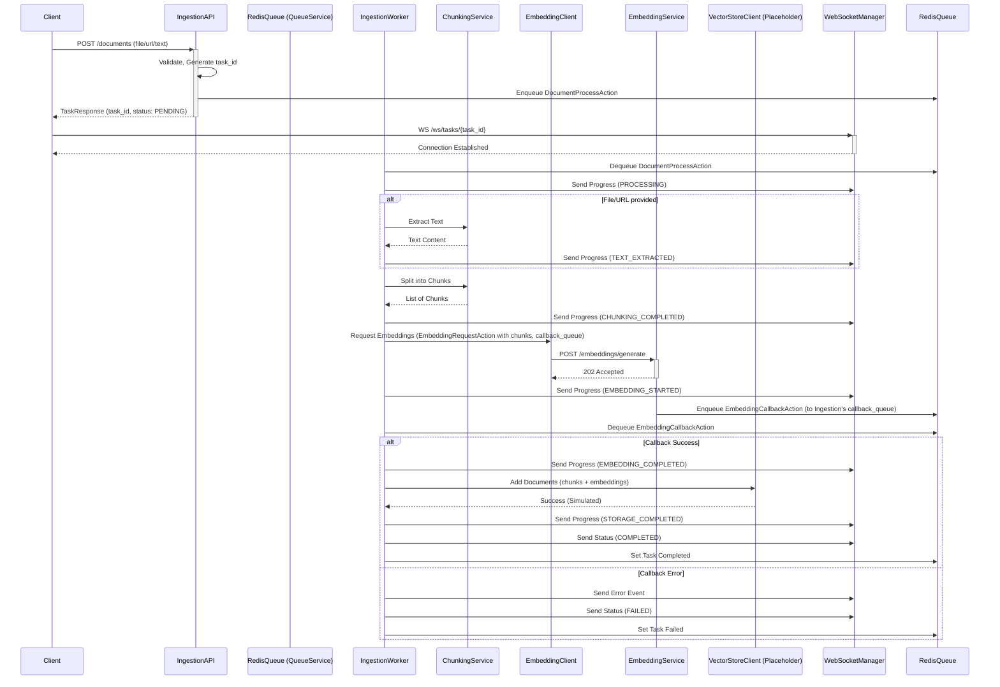

## 1. Objetivo del Servicio

El Servicio de Ingestión es responsable de recibir documentos, URLs o texto plano, procesarlos, extraer su contenido, dividirlos en fragmentos (chunks), solicitar la generación de embeddings para estos fragmentos y, finalmente (aunque actualmente es un placeholder), almacenarlos en una base de datos vectorial (Vector Store) para su posterior búsqueda y recuperación. Proporciona actualizaciones en tiempo real del estado del procesamiento a través de WebSockets.

## 2. Arquitectura y Componentes Principales

El servicio está construido con Python, FastAPI para la API REST y WebSockets, y Redis para la gestión de colas y el estado temporal de las tareas. Utiliza LlamaIndex para la extracción de texto y el chunking.

### 2.1. Entrypoint (`main.py`)

- **Aplicación FastAPI**: Inicializa la aplicación FastAPI, configura CORS, routers y manejadores de errores globales.
- **Middleware**: `CORSMiddleware` para permitir orígenes configurados.
- **Manejo de Errores**: Captura `ServiceError` y excepciones generales, devolviendo respuestas JSON estandarizadas.
- **Routers**: Incluye routers de `documents.py`, `tasks.py` y `websockets.py`.
- **Health Check (`/health`)**: Verifica la conexión a Redis (`queue_service`) y el estado del `worker_pool`.
- **Eventos de Startup/Shutdown**:
    - `startup_event`: Inicializa `queue_service` y arranca el `worker_pool` (si `AUTO_START_WORKERS` es true).
    - `shutdown_event`: Detiene el `worker_pool` y cierra las conexiones de `queue_service`.

### 2.2. Workers

- **`WorkerPool` (`workers/worker_pool.py`)**:
    - Gestiona un pool de instancias de `IngestionWorker` para procesamiento paralelo.
    - El número de workers se configura mediante `settings.WORKER_COUNT`.
    - Métodos `start()`, `stop()`, `status()`.
- **`IngestionWorker` (`workers/ingestion_worker.py`)**:
    - Es el worker principal que procesa las tareas de ingestión.
    - **Escucha Múltiples Colas**: Utiliza `asyncio.gather` para escuchar concurrentemente:
        - `settings.DOCUMENT_QUEUE` para `DocumentProcessAction`.
        - `settings.EMBEDDING_CALLBACK_QUEUE` para `EmbeddingCallbackAction` (respuestas del Embedding Service).
        - `settings.TASK_STATUS_QUEUE` para `TaskStatusAction` (ej. cancelación, aunque la lógica de cancelación está marcada como TODO).
        - `settings.INGESTION_ACTIONS_QUEUE` para acciones directas como validación de colecciones (actualmente placeholders).
    - **Lógica de Procesamiento (`_process_document`)**:
        1.  Recibe `DocumentProcessAction`.
        2.  Almacena información de callback (si la acción original es pseudo-síncrona, aunque este patrón no parece ser el principal para ingestión de documentos).
        3.  Envía actualizaciones de estado y milestones vía WebSocket (`event_dispatcher`).
        4.  **Extracción de Texto**: Simulado si no se provee `text_content`. TODO para implementar extracción real basada en `document_origin` (e.g., S3, URL).
        5.  **Chunking**: Llama a `chunking_service.split_document_intelligently()`.
        6.  **Solicitud de Embeddings**: Construye `EmbeddingRequestAction`, establece `callback_queue_name` a `settings.EMBEDDING_CALLBACK_QUEUE` y `callback_action_type` a `embedding.callback`. Envía la acción al Embedding Service usando `embedding_client.request_embeddings()` (que en realidad es `embedding_client.generate_embeddings()`).
    - **Manejo de Callback de Embeddings (`_handle_embedding_callback`)**:
        1.  Recibe `EmbeddingCallbackAction`.
        2.  Si es exitoso, crea `VectorDocument` y llama a `vector_store_client.add_documents()` (actualmente un placeholder).
        3.  Envía milestones (`embedding_completed`, `storage_completed`) y estado final (`TaskStatus.COMPLETED`) vía WebSocket.
        4.  Si la solicitud original era pseudo-síncrona, envía `DomainActionResponse`.
        5.  Envía `CollectionIngestionStatusAction` (aún no se ha definido a dónde va esta acción, pero podría ser para Agent Orchestrator).
        6.  Si falla, actualiza el estado a `TaskStatus.FAILED`.
    - **Gestión de Callbacks Pseudo-Síncronos**: Métodos `_store_callback_info`, `_retrieve_callback_info`, `_send_sync_response` para manejar respuestas directas a `DomainAction`s específicas (ej. `ingestion.collections.validate`).

### 2.3. Handlers

No existe un directorio `handlers` separado como en otros servicios. La lógica de manejo de acciones está integrada principalmente dentro del `IngestionWorker`.

### 2.4. Servicios Internos

- **`ChunkingService` (`services/chunking.py`)**:
    - **Extracción de Texto**: Utiliza LlamaIndex (`PDFReader`, `DocxReader`, etc.) y un `CustomHTMLReader` (basado en BeautifulSoup) para extraer texto de diversos formatos de archivo.
    - **Validación de Archivos (`validate_file`)**: Verifica tipo MIME, tamaño máximo (`settings.MAX_FILE_SIZE`).
    - **Fragmentación (`split_text_into_chunks`, `split_document_intelligently`)**: Utiliza `llama_index.core.node_parser.SentenceSplitter` con `tiktoken` (modelo `gpt-4`) para dividir el texto en chunks semánticos. Limita el número de chunks a `settings.MAX_CHUNKS_PER_DOCUMENT`.
- **`QueueService` (`services/queue.py`)**:
    - Gestiona la comunicación con Redis para colas y metadatos de tareas.
    - **Métodos Principales**:
        - `enqueue()`: Añade una `DomainAction` a una cola Redis y guarda metadatos de la tarea (estado "pending", timestamps) en un hash Redis (`prefix:meta:{task_id}`).
        - `dequeue()` / `dequeue_as_type()`: Extrae acciones de la cola (bloqueante con `BLPOP`), actualiza el estado de la tarea a "processing".
        - `get_task_status()`: Recupera los metadatos de una tarea desde Redis.
        - `set_task_completed()` / `set_task_failed()`: Actualiza el estado y resultado/error de la tarea en Redis.
        - `acquire_lock()` / `release_lock()`: Implementación de locks distribuidos básicos.

### 2.5. Clientes

- **`EmbeddingClient` (`clients/embedding_client.py`)**:
    - Envía solicitudes HTTP POST (esperando un `202 Accepted`) al Embedding Service (`/api/v1/embeddings/generate`) para generar embeddings para los chunks. La acción enviada es `EmbeddingRequestAction`.
- **`VectorStoreClient` (`clients/vector_store_client.py`)**:
    - **PLACEHOLDER**: Define una interfaz abstracta (`VectorDocument` model) para interactuar con una base de datos vectorial.
    - Métodos como `add_documents()`, `delete_documents()`, `search()` están definidos pero no implementados.
    - La lógica de almacenamiento real en un Vector Store es un **TODO**.

### 2.6. Modelos de Datos

- **`models/actions.py`**: Define las `DomainAction` específicas del servicio:
    - `DocumentProcessAction`: Acción principal para iniciar la ingestión de un documento, URL o texto.
    - `DocumentChunkAction`: (No parece usarse directamente por el worker principal, pero está definida).
    - `EmbeddingRequestAction`: Enviada al Embedding Service.
    - `EmbeddingCallbackAction`: Recibida del Embedding Service.
    - `TaskStatusAction`, `TaskCancelAction`: Para gestión de tareas.
- **`models/tasks.py`**: Define la estructura de las tareas y su estado:
    - `TaskStatus`: Enum (PENDING, PROCESSING, EXTRACTING, CHUNKING, EMBEDDING, STORING, COMPLETED, FAILED, CANCELLED).
    - `TaskType`, `TaskSource`: Enums para categorizar tareas.
    - `TaskProgress`: Modelo para el progreso detallado.
    - `Task`: Modelo Pydantic principal que representa una tarea de ingestión, devuelto por la API.
- **`models/events.py`**: Define los modelos para eventos WebSocket:
    - `EventType`: Enum para diferentes tipos de eventos (PROGRESS_UPDATED, TASK_COMPLETED, ERROR, etc.).
    - `WebSocketEvent`: Modelo base para todos los eventos.
    - `TaskProgressEvent`, `TaskStatusEvent`, `ErrorEvent`, `ProcessingMilestoneEvent`: Modelos específicos para diferentes tipos de notificaciones.

### 2.7. Rutas API

- **`routes/documents.py`**: Endpoints para iniciar la ingestión.
    - `POST /api/v1/documents/`: Endpoint principal para subir archivos, URLs o texto. Crea `DocumentProcessAction` y la encola. Devuelve un objeto `Task` con `task_id`.
    - `POST /api/v1/documents/text`, `POST /api/v1/documents/url`: Endpoints alternativos para texto y URL con payload JSON.
- **`routes/tasks.py`**: Endpoints para gestionar tareas.
    - `GET /api/v1/tasks/{task_id}`: Consulta el estado de una tarea (obtenido de `queue_service.get_task_status()`).
    - `DELETE /api/v1/tasks/{task_id}`: Solicita la cancelación de una tarea (encola `TaskCancelAction`).
    - `GET /api/v1/tasks/`: Lista tareas (actualmente un placeholder, devuelve lista vacía).
- **`routes/websockets.py`**: Endpoint para conexiones WebSocket.
    - `WS /ws/tasks/{task_id}`: Permite a los clientes conectarse para recibir actualizaciones en tiempo real para una tarea específica. Requiere `tenant_id` y `token` (autenticación TODO).
    - Utiliza `ConnectionManager` y `EventDispatcher`.

### 2.8. Configuración (`config/settings.py`)

- Define configuraciones como:
    - Conexión a Redis (`REDIS_HOST`, `REDIS_PORT`, etc.).
    - Nombres de colas (`DOCUMENT_QUEUE`, `EMBEDDING_CALLBACK_QUEUE`, `TASK_STATUS_QUEUE`, `INGESTION_ACTIONS_QUEUE`).
    - Parámetros de chunking (`DEFAULT_CHUNK_SIZE`, `DEFAULT_CHUNK_OVERLAP`, `MAX_CHUNKS_PER_DOCUMENT`).
    - Límites (`MAX_FILE_SIZE`, `MAX_TEXT_LENGTH_PER_DOCUMENT`).
    - URLs de servicios externos (`EMBEDDING_SERVICE_URL`).
    - Configuración de workers (`WORKER_COUNT`, `AUTO_START_WORKERS`).
    - `JOB_TIMEOUT` para la expiración de metadatos de tareas en Redis.

## 3. Flujo de Comunicación y Patrones

1.  **Solicitud de Ingestión (API REST)**:
    - El cliente envía una solicitud a `POST /api/v1/documents/` (o `/text`, `/url`) con los datos del documento, `tenant_id`, `collection_id`, `document_id` y otros metadatos.
    - El servicio valida la solicitud, genera un `task_id` único.
    - Crea una `DocumentProcessAction` y la encola en `settings.DOCUMENT_QUEUE` usando `queue_service`.
    - Responde inmediatamente al cliente con el `task_id` y el estado inicial de la tarea (`PENDING`).
2.  **Conexión WebSocket (Opcional)**:
    - El cliente utiliza el `task_id` para establecer una conexión WebSocket a `WS /ws/tasks/{task_id}`.
    - `ConnectionManager` gestiona estas conexiones.
3.  **Procesamiento Asíncrono por `IngestionWorker`**:
    - Un `IngestionWorker` toma la `DocumentProcessAction` de la cola.
    - **Extracción y Chunking**: Si es un archivo, se extrae el texto. El texto se divide en chunks usando `ChunkingService`.
    - **Solicitud de Embeddings**: El worker construye una `EmbeddingRequestAction` (conteniendo los chunks, `task_id`, y `callback_queue_name` = `settings.EMBEDDING_CALLBACK_QUEUE`) y la envía al Embedding Service a través de `EmbeddingClient` (HTTP POST, espera 202).
    - Durante estos pasos, el worker envía actualizaciones de progreso y milestones (`document_received`, `text_extracted`, `chunking_completed`, `embedding_started`) a los clientes WebSocket suscritos a través de `EventDispatcher`.
4.  **Callback del Embedding Service**:
    - El Embedding Service, una vez procesada la solicitud, envía una `EmbeddingCallbackAction` a la `settings.EMBEDDING_CALLBACK_QUEUE` especificada por el Ingestion Service.
    - El `IngestionWorker` (que también escucha esta cola) recibe el callback.
5.  **Almacenamiento y Finalización**:
    - Si el callback es exitoso, el worker prepara los `VectorDocument` (chunks + embeddings).
    - Intenta guardar estos documentos usando `vector_store_client.add_documents()` (actualmente un placeholder).
    - Envía milestones (`embedding_completed`, `storage_completed`) y el estado final (`TaskStatus.COMPLETED` o `TaskStatus.FAILED`) vía WebSocket.
    - Actualiza el estado de la tarea en Redis (`queue_service.set_task_completed` o `set_task_failed`).
    - Envía una `CollectionIngestionStatusAction` (destino y propósito exacto por definir).
6.  **Consulta de Estado (API REST)**:
    - El cliente puede consultar el estado de la tarea en cualquier momento usando `GET /api/v1/tasks/{task_id}`.

## 4. Integración con Otros Servicios

- **Embedding Service**: Solicita la generación de embeddings para los chunks de texto. La comunicación es asíncrona: Ingestion Service envía una `EmbeddingRequestAction` (HTTP POST) y espera una `EmbeddingCallbackAction` en una cola Redis específica.
- **Vector Store (Conceptual)**: El servicio está diseñado para almacenar los chunks y sus embeddings en una base de datos vectorial, pero el cliente (`VectorStoreClient`) es actualmente un placeholder. La integración real es un trabajo pendiente.
- **(Potencial) Agent Orchestrator Service**: El envío de `CollectionIngestionStatusAction` sugiere una notificación a otro servicio (posiblemente Agent Orchestrator) cuando la ingestión de documentos para una colección se actualiza. Los detalles de esta integración no están completamente definidos en el código revisado.
- **Redis**: Utilizado extensivamente como broker de mensajes para colas de `DomainAction` y como almacén temporal para el estado y metadatos de las tareas.

## 5. Capacidades Actuales

- Recepción de documentos vía subida de archivos, URL o texto plano.
- Validación de archivos (tipo, tamaño).
- Extracción de texto de múltiples formatos (PDF, DOCX, HTML, TXT, imágenes básicas, etc.) usando LlamaIndex.
- Fragmentación (chunking) inteligente de texto con LlamaIndex, configurable.
- Comunicación asíncrona con el Embedding Service para solicitar embeddings.
- Gestión de tareas de ingestión con seguimiento de estado (PENDING, PROCESSING, etc.) almacenado en Redis.
- Notificaciones en tiempo real del progreso y estado de las tareas a través de WebSockets.
- API REST para iniciar ingestiones, consultar estado de tareas y solicitar cancelación.
- Sistema de workers en pool para procesamiento paralelo.

## 6. Limitaciones y Puntos Pendientes

- **Integración con Vector Store**: El `VectorStoreClient` es un placeholder. La lógica para almacenar y gestionar documentos/embeddings en una base de datos vectorial real no está implementada. Esta es la limitación más significativa.
- **Persistencia de Archivos**: El manejo de archivos subidos es temporal (`file_key = f"temp/{task_id}/{file.filename}"`). No hay integración con un sistema de almacenamiento persistente como S3 para los archivos originales. La extracción de texto de URLs también implica una descarga temporal, sin persistencia del contenido original de la URL.
- **Manejo de Errores y Retries**: Aunque hay manejo básico de errores, estrategias de reintento robustas para comunicación con servicios externos (Embedding Service, futuro Vector Store) o para pasos de procesamiento podrían mejorarse.
- **Seguridad y Autenticación**: La verificación de tokens en el endpoint WebSocket (`verify_task_access`) es un TODO. La autenticación/autorización general de API podría requerir revisión y fortalecimiento.
- **Cancelación de Tareas**: La acción `TaskCancelAction` se encola, pero la lógica real para detener un `IngestionWorker` a mitad de proceso (especialmente durante llamadas a servicios externos o chunking intensivo) no está completamente detallada y puede ser compleja de implementar de forma segura.
- **Listado de Tareas**: El endpoint `GET /api/v1/tasks/` es un placeholder y no lista tareas reales, ya que requeriría una base de datos persistente para las tareas más allá de los metadatos temporales en Redis.
- **Extracción de Texto de URLs**: La lógica para descargar y procesar contenido de URLs dentro del `IngestionWorker` (después de que `DocumentProcessAction.url` es recibido) no está explícitamente mostrada, pero se asume que ocurriría antes del chunking.
- **Configuración de `CollectionIngestionStatusAction`**: El destino y el consumidor de esta acción no están claros.
- **Manejo de `TASK_STATUS_QUEUE`**: El `IngestionWorker` escucha esta cola, pero la lógica para `TaskStatusAction` (aparte de `TaskCancelAction`) no está detallada.
- **Escalabilidad del `WorkerPool`**: El `WorkerPool` actual crea un número fijo de workers. Mecanismos de autoescalado basados en la carga de la cola podrían ser una mejora futura.
- **Métricas y Observabilidad**: Faltan métricas detalladas sobre el rendimiento de la ingestión, tasas de error, etc.

## 7. Resumen de Archivos y Módulos Clave

- `main.py`: Entrypoint de la aplicación FastAPI, configuración inicial.
- `workers/ingestion_worker.py`: Lógica central de procesamiento de tareas de ingestión.
- `workers/worker_pool.py`: Gestión del pool de `IngestionWorker`.
- `services/chunking.py`: Extracción de texto y fragmentación con LlamaIndex.
- `services/queue.py`: Interacción con Redis para colas y estado de tareas.
- `clients/embedding_client.py`: Cliente HTTP para el Embedding Service.
- `clients/vector_store_client.py`: Cliente placeholder para el Vector Store.
- `models/actions.py`: Modelos Pydantic para `DomainAction`s.
- `models/tasks.py`: Modelos Pydantic para tareas y su estado.
- `models/events.py`: Modelos Pydantic para eventos WebSocket.
- `routes/documents.py`: Endpoints API para iniciar la ingestión.
- `routes/tasks.py`: Endpoints API para consultar/gestionar tareas.
- `routes/websockets.py`: Endpoint para conexiones WebSocket.
- `websockets/connection_manager.py`: Gestión de conexiones WebSocket activas.
- `websockets/event_dispatcher.py`: Envío de eventos a través de WebSockets.
- `config/settings.py`: Configuración del servicio.

## 8. Diagrama de Flujo Simplificado (ASCII)

---
*Documentación generada por Cascade AI.*
