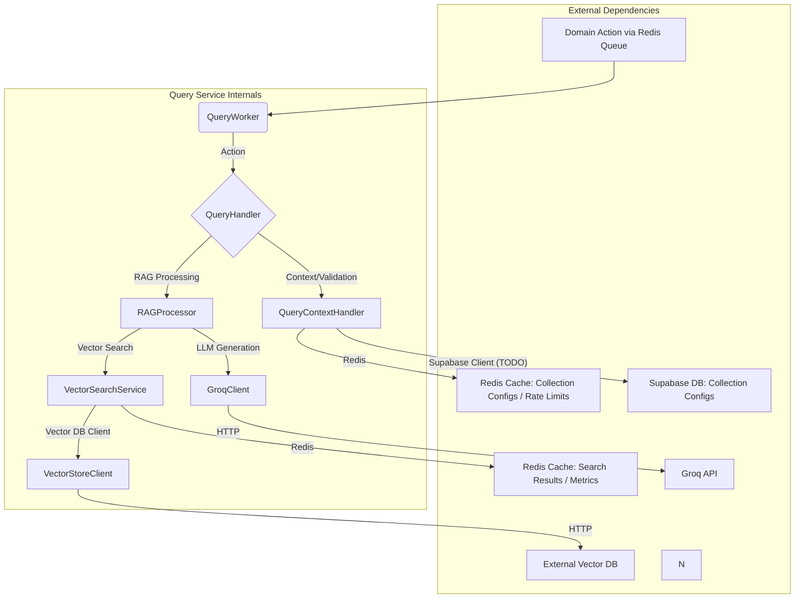

# Documentación Detallada: Query Service

## 1. Objetivo del Servicio

El **Query Service** es un componente fundamental de la plataforma Nooble4, diseñado para interpretar y responder consultas en lenguaje natural utilizando un flujo de **Retrieval-Augmented Generation (RAG)**. Su principal objetivo es buscar información relevante dentro de colecciones de documentos vectorizados y utilizar esa información, junto con modelos de lenguaje grandes (LLMs), para generar respuestas coherentes y contextualmente precisas a las preguntas de los usuarios o agentes.

El servicio está diseñado para ser robusto, escalable y configurable, con soporte para diferentes tiers de servicio que ofrecen distintas capacidades y límites de uso.

Principales Funcionalidades:
- Procesamiento de consultas RAG (`query.generate`).
- Búsqueda vectorial de documentos (`query.search`).
- Integración con LLMs (actualmente Groq) para la generación de respuestas.
- Soporte para múltiples colecciones de documentos vectorizados.
- Control de calidad de la información recuperada mediante umbrales de similitud. RAGProcessor

## 2. Arquitectura y Componentes Principales

Query Service sigue una arquitectura de microservicio basada en Python, utilizando FastAPI para la estructura base (aunque las interacciones principales son asíncronas vía colas Redis) y Pydantic para la validación de modelos de datos.



**Componentes Clave:**

*   
## 3. Comunicaciones del Servicio

Query Service se comunica con otros servicios y sistemas principalmente de forma asíncrona a través de colas Redis y, para dependencias externas como Groq o el Vector DB, mediante HTTP.

**Entrada (Consumo de Acciones):**
*   **Colas de Acciones Redis**: El `QueryWorker` se suscribe a colas Redis específicas por tier para recibir `DomainAction`s. Los nombres de las colas siguen el patrón: `nooble4:{environment}:query:{tier}:{action_type}` (e.g., `nooble4:dev:query:free:query.generate`).
    *   `query.generate`: Para iniciar un proceso RAG completo.
    *   `query.search`: Para realizar solo una búsqueda vectorial.
*   **Payloads**: Las acciones se reciben como objetos `DomainAction` (definidos en `common.models.actions`), donde el campo `data` contiene una instancia de `QueryGenerateAction` o `SearchDocsAction`.

**Salida (Callbacks y Respuestas):**
*   **Colas de Callback Redis**: Los resultados de las operaciones (o errores) se envían como `DomainActionResponse` (para pseudo-síncrono) o `QueryCallbackAction` (para callbacks asíncronos) a colas especificadas en la `DomainAction` original (`callback_queue_name`).
    *   El `callback_queue_prefix` en `settings.py` suele ser "execution", indicando que los callbacks van dirigidos a colas del servicio que originó la solicitud (e.g., Agent Execution Service).
    *   El `DomainQueueManager` se encarga de construir el nombre completo de la cola de callback.

**Comunicaciones Internas y con Dependencias Externas:**
*   **Redis**: Usado extensivamente para:
    *   Broker de mensajes (colas de acciones y callbacks).
    *   Cache de resultados de búsqueda vectorial (`VectorSearchService`).
    *   Cache de configuraciones de colecciones (`QueryContextHandler`).
    *   Rate limiting (`QueryContextHandler`).
    *   Almacenamiento de métricas de rendimiento y uso (`QueryHandler`, `VectorSearchService`).
*   **Vector Database (Externo)**: `VectorStoreClient` realiza llamadas HTTP POST a la URL configurada en `settings.vector_db_url` (endpoint `/api/v1/search`) para realizar búsquedas vectoriales.
*   **Groq API (Externo)**: `GroqClient` realiza llamadas HTTP POST a `https://api.groq.com/openai/v1/chat/completions` para la generación de texto con LLMs.
*   **Supabase (TODO - Externo)**: `QueryContextHandler` tiene una integración planificada (actualmente simulada) con Supabase para obtener configuraciones detalladas de las colecciones.
*   **(Potencial) Embedding Service**: El modelo `EmbeddingRequestAction` sugiere que Query Service podría necesitar solicitar embeddings al Embedding Service si no se proporcionan en la acción original.

## 4. Estructura de Archivos Internos

```
query_service/
├── __init__.py
├── main.py                 # Punto de entrada, inicializa y corre el worker
|
├── workers/                # Toma la base_worker de common y la extiende para el query_service
│   ├── __init__.py
│   └── query_worker.py     # QueryWorker, consume acciones de Redis
|
├── handlers/               # Funciones soporte para services
│   ├── query_handler.py    # QueryHandler, lógica de negocio principal
│   └── context_handler.py  # QueryContextHandler, validación y contexto
|
├── services/
│   ├── __init__.py
│   ├── rag_processor.py        # RAGProcessor, orquesta RAG
│   └── vector_search_service.py # VectorSearchService, búsqueda y cache vectorial
|
├── clients/
│   ├── __init__.py
│   ├── groq_client.py          # Cliente para Groq API (LLM)
│   └── qdrant_client.py        # Cliente para Vector DB externo qdrant 
|
├── models/
│   ├── __init__.py
│   └── actions.py            # Modelos Pydantic para DomainActions y payloads
|
├── config/                   # Configuración del servicio usando configuracion centralizada del modulo common
│   ├── __init__.py
│   ├── constants.py          # Constantes globales y defaults especificas del servicio query
│   └── settings.py           # Deberia leer la configuracion proporcionada por el servicio agent_execution_service
|
├── routes/                   # (Actualmente vacío o no relevante para el flujo principal)
│   └── __init__.py
|
├── Dockerfile
├── README.md
├── requirements.txt
└── documentation_query_service.md # Este archivo
```

## 5. Integración con Otros Servicios

*   **Agent Execution Service (o similar)**: Es el principal solicitante de consultas. Envía acciones `query.generate` o `query.search` y espera respuestas/pseudo asyncronas en colas que él mismo gestiona.
*   **Embedding Service**: Query Service solicita los embeddings de las consultas (`query_embedding`) como parte de las acciones. La presencia de `EmbeddingRequestAction` en `models/actions.py` hace que Query Service debe solicitar la generación de embeddings al Embedding Service.
*   **Servicios de Persistencia (PostgreSQL - Futuro)**: El `README.md` y las memorias indican que hay un plan para migrar ciertos almacenamientos temporales de Redis (e.g., configuraciones de colección, potencialmente métricas más detalladas) a PostgreSQL para persistencia a largo plazo. Actualmente, esta integración no está implementada.