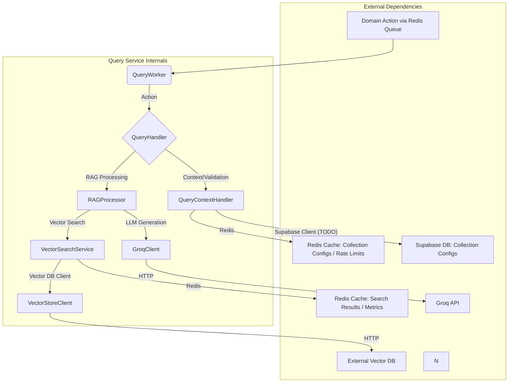

# Documentación Detallada: Query Service

## 1. Objetivo del Servicio

El **Query Service** es un componente fundamental de la plataforma Nooble4, diseñado para interpretar y responder consultas en lenguaje natural utilizando un flujo de **Retrieval-Augmented Generation (RAG)**. Su principal objetivo es buscar información relevante dentro de colecciones de documentos vectorizados y utilizar esa información, junto con modelos de lenguaje grandes (LLMs), para generar respuestas coherentes y contextualmente precisas a las preguntas de los usuarios o agentes.

El servicio está diseñado para ser robusto, escalable y configurable, con soporte para diferentes tiers de servicio que ofrecen distintas capacidades y límites de uso.

Principales Funcionalidades:
- Procesamiento de consultas RAG (`query.generate`).
- Búsqueda vectorial de documentos (`query.search`).
- Integración con LLMs (actualmente Groq) para la generación de respuestas.
- Soporte para múltiples colecciones de documentos vectorizados.
- Control de calidad de la información recuperada mediante umbrales de similitud. RAGProcessor

## 2. Arquitectura y Componentes Principales

Query Service sigue una arquitectura de microservicio basada en Python, utilizando FastAPI para la estructura base (aunque las interacciones principales son asíncronas vía colas Redis) y Pydantic para la validación de modelos de datos.



**Componentes Clave:**

*   
## 3. Comunicaciones del Servicio

Query Service se comunica con otros servicios y sistemas principalmente de forma asíncrona a través de colas Redis y, para dependencias externas como Groq o el Vector DB, mediante HTTP.

**Entrada (Consumo de Acciones):**
*   **Colas de Acciones Redis**: El `QueryWorker` se suscribe a colas Redis específicas por tier para recibir `DomainAction`s. Los nombres de las colas siguen el patrón: `nooble4:{environment}:query:{tier}:{action_type}` (e.g., `nooble4:dev:query:free:query.generate`).
    *   `query.generate`: Para iniciar un proceso RAG completo.
    *   `query.search`: Para realizar solo una búsqueda vectorial.
*   **Payloads**: Las acciones se reciben como objetos `DomainAction` (definidos en `common.models.actions`), donde el campo `data` contiene una instancia de `QueryGenerateAction` o `SearchDocsAction`.

**Salida (Callbacks y Respuestas):**
*   **Colas de Callback Redis**: Los resultados de las operaciones (o errores) se envían como `DomainActionResponse` (para pseudo-síncrono) o `QueryCallbackAction` (para callbacks asíncronos) a colas especificadas en la `DomainAction` original (`callback_queue_name`).
    *   El `callback_queue_prefix` en `settings.py` suele ser "execution", indicando que los callbacks van dirigidos a colas del servicio que originó la solicitud (e.g., Agent Execution Service).
    *   El `DomainQueueManager` se encarga de construir el nombre completo de la cola de callback.

**Comunicaciones Internas y con Dependencias Externas:**
*   **Redis**: Usado extensivamente para:
    *   Broker de mensajes (colas de acciones y callbacks).
    *   Cache de resultados de búsqueda vectorial (`VectorSearchService`).
    *   Cache de configuraciones de colecciones (`QueryContextHandler`).
    *   Rate limiting (`QueryContextHandler`).
    *   Almacenamiento de métricas de rendimiento y uso (`QueryHandler`, `VectorSearchService`).
*   **Vector Database (Externo)**: `VectorStoreClient` realiza llamadas HTTP POST a la URL configurada en `settings.vector_db_url` (endpoint `/api/v1/search`) para realizar búsquedas vectoriales.
*   **Groq API (Externo)**: `GroqClient` realiza llamadas HTTP POST a `https://api.groq.com/openai/v1/chat/completions` para la generación de texto con LLMs.
*   **Supabase (TODO - Externo)**: `QueryContextHandler` tiene una integración planificada (actualmente simulada) con Supabase para obtener configuraciones detalladas de las colecciones.
*   **(Potencial) Embedding Service**: El modelo `EmbeddingRequestAction` sugiere que Query Service podría necesitar solicitar embeddings al Embedding Service si no se proporcionan en la acción original.

## 4. Estructura de Archivos Internos

```
query_service/
├── __init__.py
├── main.py                 # Punto de entrada, inicializa y corre el worker
|
├── workers/
│   ├── __init__.py
│   └── query_worker.py     # QueryWorker, consume acciones de Redis
|
├── handlers/
│   ├── __init__.py
│   ├── query_handler.py    # QueryHandler, lógica de negocio principal
│   └── context_handler.py  # QueryContextHandler, validación y contexto
|
├── services/
│   ├── __init__.py
│   ├── rag_processor.py        # RAGProcessor, orquesta RAG
│   └── vector_search_service.py # VectorSearchService, búsqueda y cache vectorial
|
├── clients/
│   ├── __init__.py
│   ├── groq_client.py          # Cliente para Groq API (LLM)
│   └── vector_store_client.py  # Cliente para Vector DB externo
|
├── models/
│   ├── __init__.py
│   └── actions.py            # Modelos Pydantic para DomainActions y payloads
|
├── config/
│   ├── __init__.py
│   ├── constants.py          # Constantes globales y defaults
│   └── settings.py           # QueryServiceSettings, configuración del servicio
|
├── routes/                   # (Actualmente vacío o no relevante para el flujo principal)
│   └── __init__.py
|
├── tests/                    # (No revisado en este análisis)
│
├── Dockerfile
├── README.md
├── requirements.txt
└── documentation_query_service.md # Este archivo
```

## 5. Integración con Otros Servicios

*   **Agent Execution Service (o similar)**: Es el principal solicitante de consultas. Envía acciones `query.generate` o `query.search` y espera respuestas/pseudo asyncronas en colas que él mismo gestiona.
*   **Embedding Service**: Query Service solicita los embeddings de las consultas (`query_embedding`) como parte de las acciones. Sin embargo, la presencia de `EmbeddingRequestAction` en `models/actions.py` sugiere que Query Service podría tener la capacidad de solicitar la generación de embeddings al Embedding Service si fuera necesario (aunque este flujo no está explícitamente implementado en los handlers revisados).
*   **Servicios de Persistencia (PostgreSQL - Futuro)**: El `README.md` y las memorias indican que hay un plan para migrar ciertos almacenamientos temporales de Redis (e.g., configuraciones de colección, potencialmente métricas más detalladas) a PostgreSQL para persistencia a largo plazo. Actualmente, esta integración no está implementada.

## 6. Inconsistencias, Código Muerto o Duplicado, y Puntos de Mejora

*   **Configuración de Colecciones desde DB (TODO)**: `QueryContextHandler` simula la obtención de configuraciones de colección desde una base de datos (Supabase). Esto es un **TODO crítico** para la funcionalidad completa y personalización por colección/tenant.
*   **Cache de Búsqueda - Hash de Embedding**: `VectorSearchService` utiliza un hash de una muestra del embedding para la clave de caché. Si bien es una optimización, introduce una pequeña posibilidad teórica de colisiones. Considerar si el riesgo/beneficio es adecuado o si se puede usar un hash completo de forma eficiente.
*   **Superposición de Constantes y Settings**: Existe cierta superposición en la definición de constantes (e.g., TTLs, límites por tier) entre `config/constants.py` y `config/settings.py`. Se debe asegurar que `settings.py` (configurable por entorno) sea la fuente autoritativa y que las constantes solo definan valores por defecto no configurables o valores que no cambian.
*   **Error Handling en Clientes**: Los clientes HTTP (`VectorStoreClient`, `GroqClient`) podrían beneficiarse de un manejo de errores más granular (basado en códigos de estado HTTP específicos o errores de API) en lugar de re-lanzar excepciones genéricas. Los `TODO` en los propios archivos de cliente ya lo señalan.
*   **Abstracción de Clientes**: Los `TODO` en los clientes sugieren la posibilidad de abstraerlos para soportar múltiples backends (e.g., diferentes Vector DBs, diferentes LLMs). Esto sería una mejora significativa para la flexibilidad.
*   **Métricas y Observabilidad**: Aunque hay tracking básico de métricas en Redis, una integración más profunda con un sistema de monitoreo y observabilidad (e.g., Prometheus, Grafana, OpenTelemetry) sería beneficiosa, como se indica en los `TODO`s.
*   **Streaming de Respuestas LLM**: `GroqClient` tiene `stream: False` hardcodeado. Implementar streaming podría mejorar la latencia percibida por el usuario para respuestas largas.
*   **Endpoints HTTP Legacy/No Usados**: El directorio `routes/` parece no ser relevante para el flujo principal basado en colas. Si contiene endpoints HTTP, verificar si son necesarios, están actualizados o son código muerto.
*   **Flujo de `EmbeddingRequestAction`**: Si bien el modelo existe, el flujo donde Query Service solicita activamente embeddings no está implementado en los handlers principales. Si esta funcionalidad es necesaria, requerirá desarrollo adicional.
*   **Persistencia en PostgreSQL**: Como se menciona en el `README.md` y memorias, la migración de datos de Redis a PostgreSQL para persistencia a largo plazo es un punto pendiente importante.
*   **Robustez de `VectorStoreClient`**: Falta de reintentos y validación avanzada, como se indica en sus `TODO`s.

Este análisis proporciona una visión detallada del Query Service. La documentación se ha estructurado para ser exhaustiva y cubrir los aspectos clave solicitados.
